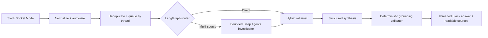
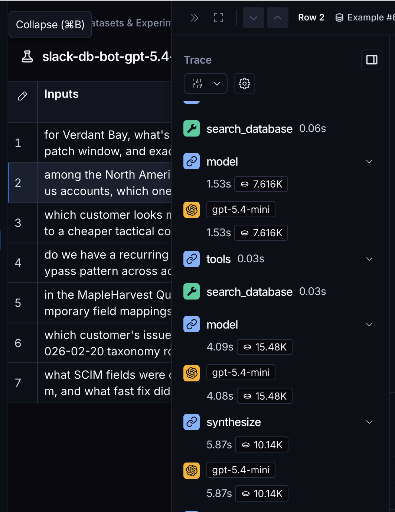

<div align="center">
  <picture>
    <source media="(prefers-color-scheme: dark)" srcset="docs/images/logo-dark.svg">
    <source media="(prefers-color-scheme: light)" srcset="docs/images/logo-light.svg">
    
  </picture>
</div>

<div align="center">
  <h3>Grounded database answers, delivered naturally in Slack.</h3>
</div>

<div align="center">
  
  
  
  
  
</div>

<br>

Grounded Q&amp;A Bot is a local Slack Socket Mode application over a synthetic startup SQLite database. It answers
direct lookups, account summaries, comparisons, and multi-source questions while exposing readable evidence, labeling
inference, surfacing gaps, and declining claims the database cannot support.

The application combines an explicit LangGraph workflow, a narrowly scoped Deep Agents investigator, hybrid retrieval,
deterministic grounding checks, persistent thread memory, and privacy-redacted LangSmith tracing and evaluation.

> [!TIP]
> Start with the human-authored [`DESIGN.md`](DESIGN.md) for the decisions behind the system and
> [`EVALUATION.md`](EVALUATION.md) for measured results, failures, and limitations.

## Why this bot?

- **Grounded by construction** — every answer claim maps to retrieved evidence; numeric details must appear in cited
  excerpts, and Slack shows readable source titles instead of internal IDs.
- **Controlled orchestration** — LangGraph owns routing, retrieval, synthesis, validation, budgets, and delivery. The
  bounded Deep Agents investigator is reserved for comparisons, recurring patterns, and superlative questions.
- **Hybrid retrieval** — read-only structured SQLite, FTS5, and local FastEmbed vectors are fused and reranked with
  deterministic entity, date, source-status, and coverage rules.
- **Slack-native conversations** — explicit mentions begin a conversation, unmentioned follow-ups work inside engaged
  threads, progress uses a lightweight reaction, and long answers fall back to a Markdown attachment.
- **Security and reliability boundaries** — workspace/channel authorization, read-only SQL, prompt-injection defenses,
  event deduplication, ordered per-thread queues, bounded retries, timeouts, and persistent conversation state.
- **Measured behavior** — 59 focused tests, seven assignment acceptance cases, a 7/7 LangSmith experiment, and a real
  Slack/OpenAI smoke test.

## Architecture



The model receives one `search_database` tool. It cannot access Slack delivery, the host filesystem, a shell, arbitrary
network calls, or unrestricted SQL. Every OpenAI role—direct answering, investigation, synthesis, repair, and semantic
evaluation—uses `gpt-5.4-mini` in the measured configuration.

## Quickstart

Prerequisites: Python 3.12+, [uv](https://docs.astral.sh/uv/), an OpenAI API key, and a Slack app installed in a test
workspace.

```bash
git clone https://github.com/piercebrookins/q_and_a_bot.git
cd q_and_a_bot
uv sync --all-groups
cp .env.example .env
```

Fill in the required values in `.env`:

```dotenv
SLACK_BOT_TOKEN=xoxb-...
SLACK_APP_TOKEN=xapp-...
SLACK_ALLOWED_WORKSPACE_ID=T...
SLACK_ALLOWED_CHANNEL_IDS=C...
SLACK_TEST_CHANNEL_ID=C...
OPENAI_API_KEY=...
```

Create or update the Slack app from [`slack-manifest.yaml`](slack-manifest.yaml). Generate an app-level token with
`connections:write`, install the app, invite it to the allowed test channel, and confirm Event Subscriptions include
`app_mention` and `message.channels`. Socket Mode does not require a public request URL or signing secret.

Run the bot:

```bash
uv run slack-db-bot
```

Mention `@LangChain Bot` in an allowed public channel. The answer appears in the source thread, and later messages in
that engaged thread work without another mention. Stop the local process with `Ctrl-C`.

> [!NOTE]
> The pinned database snapshot downloads automatically and is verified with SHA-256. Set `DATABASE_PATH` to use an
> existing verified copy instead. Runtime databases, vectors, traces, and secrets stay under ignored local paths.

## Evaluation

```bash
uv run ruff check .
uv run mypy src tests
uv run pytest -q
uv run slack-db-eval --output evaluation/results/latest.json
uv run slack-db-eval --langsmith
```

| Gate | Measured result |
| --- | ---: |
| Unit, component, and mocked end-to-end tests | 59 passed |
| Assignment acceptance cases | 7/7 |
| Required-concept recall | 100% |
| Mean graph latency | 7,163 ms |
| LangSmith quality gates | 7/7 |
| Live Slack response latency | 3,599 ms |

The versioned acceptance dataset is [`src/slack_db_bot/data/acceptance.json`](src/slack_db_bot/data/acceptance.json).
The saved local results are in [`evaluation/results/latest.json`](evaluation/results/latest.json), and the complete
methodology and limitations are in [`EVALUATION.md`](EVALUATION.md).

## LangSmith

LangSmith is part of both the application and evaluation workflow. With `LANGSMITH_TRACING=true`, the graph records
model, tool, and state-transition metadata under the configured project. `LANGSMITH_HIDE_INPUTS=true` and
`LANGSMITH_HIDE_OUTPUTS=true` keep Slack messages, database excerpts, and generated answers out of runtime traces.

The final
[`slack-db-bot-gpt-5.4-mini-gpt-5.4-mini-0b4a928b`](https://smith.langchain.com/o/b966086f-707d-4439-bdef-9e441ce1ceee/datasets/29233e7f-4918-473a-a608-b397859e763a/compare?selectedSessions=83b07b2b-1010-40d6-8fa3-b41a7154bab7)
experiment ran the real graph for all seven assignment cases and passed every quality gate.



## Security and reliability

- The source database opens with SQLite `mode=ro`, `immutable=1`, and `query_only=ON`.
- SQL permits one bounded `SELECT` over explicitly allowed tables, columns, and functions.
- Retrieved records and conversation text are treated as untrusted data and cannot change policy or tool access.
- Authenticated workspace, channel, thread, and recipient identities constrain every Slack action.
- Each turn has model, tool, rewrite, Slack-call, output-token, concurrency, queue, and 120-second wall-clock limits.
- The persistent ledger deduplicates Slack event IDs and reclaims interrupted claims after ten minutes.
- Thread state retains 12 exact turns plus a bounded extractive summary; event and conversation records expire after 30
  days.
- Structured logs retain correlation IDs and metrics while omitting prompts, evidence, answers, users, and credentials.

> [!IMPORTANT]
> Secrets belong only in the ignored `.env` file. Never commit tokens, local runtime databases, trace exports, or
> workspace identifiers.

## Scope and limitations

This is one local Python process using Slack Socket Mode. Its event ledger is persistent, but the in-memory work queue
is not durable across a process crash. Direct messages, private channels, feedback UI, hosted deployment, and row-level
database entitlements are outside the selected take-home scope.

## Project resources

- [`DESIGN.md`](DESIGN.md) — human-authored architecture and tradeoffs
- [`EVALUATION.md`](EVALUATION.md) — measured quality, latency, token, and tool-call results
- [`slack-manifest.yaml`](slack-manifest.yaml) — least-privilege Slack application manifest
- [LangSmith experiment](https://smith.langchain.com/o/b966086f-707d-4439-bdef-9e441ce1ceee/datasets/29233e7f-4918-473a-a608-b397859e763a/compare?selectedSessions=83b07b2b-1010-40d6-8fa3-b41a7154bab7) — final seven-case evaluation
